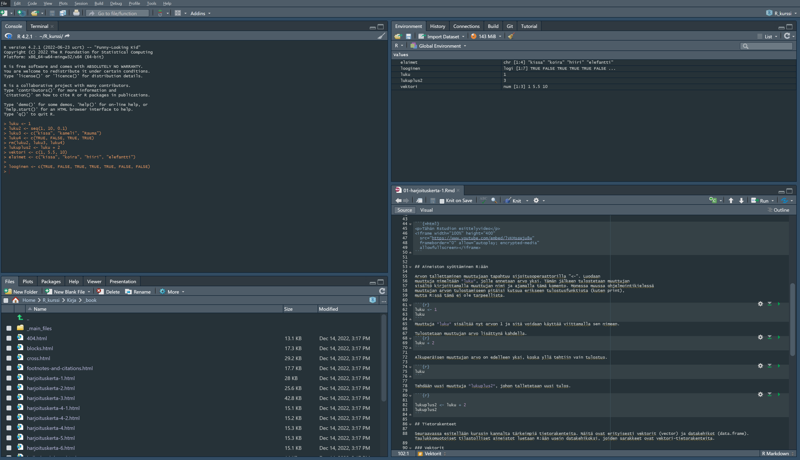

--- 
title: "Sosiaalitieteiden tilastollisten menetelmien R-harjoituskurssi, 2 op"
author: "Terhi Auvinen, Samuli Koponen, Lauri Kortelainen & Antti Kouvo"
date: "`r Sys.Date()`"
site: bookdown::bookdown_site
documentclass: book
bibliography:
- book.bib
- packages.bib
description: |
  This is a minimal example of using the bookdown package to write a book.
  set in the _output.yml file.
  The HTML output format for this example is bookdown::gitbook,
link-citations: yes
github-repo: "rstudio/bookdown-demo"
---

# R-harjoituskurssi {-}

```{r echo = FALSE, message = FALSE, warning = FALSE}

knitr::opts_chunk$set(echo = TRUE)
library(magrittr)
library(tidyverse)
library(kableExtra)

#dataset <- readRDS(paste0("./dataset"))
#df <- readRDS(paste0("./dataset2"))

luo_kurssiaikataulu <- function(bold_row = 1) {
  asiat <- c("Käsiteltävät asiat (viitteellinen asiasisältö, muutoksia voi tulla)",
    "RStudioon ja R-kieleen tutustuminen",
             "Aineiston kuvailu: frekvenssijakauma, tunnusluvut, kuviot, osa-aineiston poimiminen ja aineston ryhmittäinen tarkastelu",
             "Yksinkertaiset muuttujamuunnokset, kahden muuttujan välinen yhteisvaihtelu, ristiintaulukointi",
             "Korrelaatiot ja hajotakuvio, summamuuttujan tekeminen",
             "Keskiarvotestit: t-testi ja ANOVA",
             "Kertausta ja ohjausta ryhmätehtävään")
  taul1 <- tibble(c("Osa", 1:6), col2 = asiat)
  taul1 %>% kable(col.names = NULL) %>% 
    row_spec(1, bold = TRUE, color = "white", background="#077d9e") %>% 
    row_spec(seq(2,nrow(taul1),2), background="#ccd8df") %>% 
    row_spec(seq(3,nrow(taul1),2), background="#e7ecf0") %>% 
    row_spec(bold_row, bold=TRUE, font_size = 17) %>% 
    kableExtra::kable_styling()
}
```


```{r include=FALSE}
# automatically create a bib database for R packages
knitr::write_bib(c(
  .packages(), 'bookdown', 'knitr', 'rmarkdown', 'tidyverse', 'magrittr'
), 'packages.bib')
```

<!--chapter:end:index.Rmd-->

# Harjoituskerta 1

```{r, echo=FALSE}

luo_kurssiaikataulu(2)
```

#### Ohjelmassa tänään {-}

- Päivän aikataulu
- Muita käytännön asioita
- Kurssin suorittaminen ja sisältö
- RStudion toimintojen esittely ja R-kielen perusteita
- Harjoitus / kotitehtävän tehtävänanto

## Yleiset asiat

## Kyselytutkimus
 
```{=html}
<p>Tilastollisen tutkimuksen (kyselytutkimuksen) perusjutuista harkiten kertausmateriaalia luentotallenteeksi</p>
<iframe width="100%" height="400"
  src="https://www.youtube.com/embed/cNXO6znx7PI"
  frameborder="0" allow="autoplay; encrypted-media"
  allowfullscreen></iframe>
```

## R ja RStudio

```{=html}
<p>Tähän Rstudion esittelyvideo</p>
<iframe width="100%" height="400"
  src="https://www.youtube.com/embed/lVKMsaWju8w"
  frameborder="0" allow="autoplay; encrypted-media"
  allowfullscreen></iframe>
```


## Aineiston syöttäminen R:ään

Arvon tallettaminen muuttujaan tapahtuu sijoitusoperaattorilla "<-". Luodaan 
muuttuja nimeltään *luku*, jolle annetaan arvo yksi. Tämän jälkeen tulostetaan muuttujan 
sisältö kirjoittamalla muuttujan nimi ja ajamalla tämä komento. Monessa muussa ohjelmointikielessä
muuttujan arvon tulostamiseen pitäisi kutsua erikseen tulostusfunktiota (kuten print), 
mutta R:ssä tämä ei ole tarpeellista.

```{r}
luku <- 1
luku
```
Muuttuja *luku* sisältää nyt arvon 1 ja sitä voidaan käyttää viittamalla sen nimeen.

Tulostetaan muuttujan arvo lisättynä kahdella.
```{r}
luku + 2
```

Alkuperäisen muuttujan arvo on edelleen yksi, koska yllä tehtiin vain tulostus.

```{r}
luku
```

Tehdään uusi muuttuja *lukuplus2*, johon talletetaan uusi tulos.

```{r}
lukuplus2 <- luku + 2
lukuplus2
```

## Tietorakenteet

Seuraavassa esitellään kurssin kannalta tärkeimpiä tietorakenteita. Näitä ovat erityisesti vektorit (vector) ja datakehikot (data.frame). Taulukkomuotoiset tilastolliset aineistot luetaan R:ään usein datakehikoksi, joiden sarakkeet ovat vektori-tietorakenteita. 

### Vektorit

Vektori on R:n yksinkertaisin tietorakenne. Vektorit koostuvat alkioista ja alkiot ovat
vektorissa tietyssä järjestyksessä. Vektori luodaan funktiolla **c**. Itse asiassa yllä
luotu muuttujat ja *luku* ja *lukuplus2* ovat vektoreita (ns. skalaarivektoreita),
joiden pituus on yksi. Tällöin ei tarvitse käyttää funktiota **c**.

Luodaan vektori, jossa on luvut 1, 5.5 ja 10 ja talletetaan se muuttujaan *vektori1*.
```{r}
vektori1 <- c(1, 5.5, 10)
```

Vektorin alkioihin viitataan hakasulkeilla. Tulostetaan edellä luodun vektorin toinen alkio.

```{r}
vektori1[2]
```

Vektorin alkioiden täytyy olla aina samaa tietotyyppiä. Keskeisimmät tietotyypit
ovat numeerinen eli reaaliluku (numeric), merkkijono (character) sekä looginen (logical). Edellä luodut
vektorit olivat tietotyyppiä **numeric**. Vektori, joka on tietotyyppiä looginen, saa arvoja TRUE tai FALSE. 
Alla esimerkkejä vektoreista, jotka ovat tyypiltään merkkijonoja ja loogisia.
Vektorin tietotyypin voi kätevästi selvitää funktion **typeof** avulla. Vektorin pituus
saadaan selville käyttämällä funktiota **length**.

```{r}
library(tidyverse)
# Selvitetään edellä luomamme vektori1:sen tietotyyppi
typeof(vektori1)
# Luodaan vektori, joka on tyypiltään merkkijono
elaimet <- c("kissa", "koira", "hiiri", "elefantti")
# varmistetaan tietotyyppi typeof-funktiolla
typeof(elaimet)
# Looginen tietotyyppi
looginen <- c(TRUE, FALSE, TRUE, TRUE, TRUE, FALSE, FALSE)
looginen
typeof(looginen)

# Selvitetään aiemmin luotujen vektorien pituudet
length(luku)
length(vektori1)
length(elaimet)
length(looginen)
```

Tietotyypin ja vektorin pituuden voi tarkistaa myös *environment*-välilehden alta, jossa on listattu kaikki vektorit, muuttujat, yms. 


:::{.tehtava}
[Harjoitus:]{.harj_teksti} Kokeile R-studiossa luoda uusia vektoreita. 
Tutki niiden tietotyyppejä ja pituuksia. Mitä tapahtuu, jos luot vektorin arvoilla 2, "kissa", 5?
::: 

```{r harj1, exercise=TRUE}
c(1, "kissa")

```


### Datakehikko

## Työskentely R:ssä

R käyttää työkansiota, johon se oletusarvoisesti tallentaa tiedostot ja joita se käyttää "juurena". Esimerkiksi aineistoa tuodessa viitataan tähän kansioon, joten sen sijainti tulee olla selvillä. Työkansion polku voidaan tarkistaa *getwd*-komennolla:

``` {r}
getwd()
```

Työskentelyn helpottamiseksi tiedostot kannattaa siirtää työkansioon tai työkansio voidaan muuttaa *setwd*-komennolla:
``` {r}
#setwd("C:/Users/samuliko/OneDrive - University of Eastern Finland/Documents/R_kurssi")
```

## Aineiston tuominen R:ään

### European Social Survey 2016

- Kurssin opetuksessa käytetään European Social Survey (ESS) Suomen aineistoa vuodelta 2016.
  - Haastattelututkimus, joka kartoittaa yhteiskunnalliseen kehitykseen liittyvää arvojen, asenteiden ja käyttäytymisen muutosta. ESS kerää vertailukelpoista surveydataa noin 30 Euroopan maasta. [Lisätietoja](https://www.fsd.tuni.fi/fi/aineistot/kansainvalisia-aineistosarjoja/european-social-survey/)
- Uusin saatavissa oleva Suomen aineisto on 8. kierrokselta (vuosi 2016). Sen teemoina on mm. ilmastonmuutos, energiavarmuus ja hyvinvointi
  - FSD3217 European Social Survey 2016: Suomen aineiston on Tietoarkiston kautta vapaasti käytettävissä ilman rekisteröitymistä.
- **Lataa aineisto [täältä](http://urn.fi/urn:nbn:fi:fsd:T-FSD3217) ** seuraavaan harjoituskertaan mennessä 
- Aineisto kannattaa tallentaa omaan (UEFin) o365 OneDriveen, jolloin se on käytettävissä kaikilla työasemilla

``` {r}
#read.csv2("./FSD3217/Study/Data/daF3217.csv")
```

## Aineiston käsitteleminen

Siinä missä muissa tilasto-ohjelmissa (esim. SPSS ja Stata) voi olla auki vain yksi aineisto kerrallaan, R:ssä voi olla samanaikaisesti auki monta aineistoa, muuttujaa ja matriisia. R käsittää aineiston matriisina. Esimerkiksi tällä kurssilla käytettävän ESS-aineiston R käsittää 1925*309 matriisina.

## Aineiston kuvailu

### Plot

### Boxplot

### Ristiintaulukointi

```{r}
#table(ess$a2)

# Yksittäinen muuttuja voidaan myös kopioda omaksi muuttujakseen ja ottaa frekvenssit siitä

#intenet <- ess$a2
#table(internet)
```

<!--chapter:end:01-harjoituskerta-1.Rmd-->


# Harjoituskerta 2

```{r, echo = FALSE}
luo_kurssiaikataulu(3)
```


<center>

```{r, fig.align='center', dev='png', echo = FALSE}
DiagrammeR::grViz("digraph {
  graph [layout = dot, rankdir = TB, center=TRUE,
  label=
  <
  <br/> Jakauman tarkastelu  <br/>
    <font point-size='30'>Minkälainen muuttuja on kyseessä?</font>
  <br/>
  >, labelloc=top,
  fontsize = '40', margin='1.5']
  
  node [shape = rectangle, style='filled', fontname = Helvetica, fontsize = '20']        
  rec1 [label = 'Luokittelu', fillcolor='#077d9e', fontcolor='white']
  rec2 [label = 'Järjestys', fillcolor='#077d9e', fontcolor='white']
  rec3 [label =  'Välimatka', fillcolor='#077d9e', fontcolor='white']
  rec4 [label = 'Suhde', fillcolor='#077d9e', fontcolor='white']
  rec5 [label = 'Epäjatkuvat', fillcolor='#ccd8df']
  rec6 [label = 'Jatkuvat', fillcolor='#ccd8df']
  rec7[label = 
    <
    <br/> &#8226; Frekvenssit <br ALIGN = 'LEFT'/> &#8226; Sijaintiluvut: moodi, mediaani<br ALIGN = 'LEFT'/> &#8226; Pylväsdiagrammi <br ALIGN = 'LEFT' />
    >, fillcolor='#e7ecf0'
]

rec8[label = 
    <
    <br/> &#8226; Sijaintiluvut: moodi, mediaani, keskiarvo<br ALIGN = 'LEFT'/> &#8226; Hajontaluvut: vaihteluväli, keskihajonta, vinous, huipukkuus<br ALIGN = 'LEFT'/> &#8226; Histogrammi <br ALIGN = 'LEFT' />
    >, fillcolor='#e7ecf0'
]


  
  # edge definitions with the node IDs
  rec1 -> rec5; rec2 -> rec5; rec3 -> rec6; rec4 -> rec6;
  rec5 -> rec7; rec6 -> rec8
  }",
  height = '100%', width = '100%')
```

</center>


## Valmiin aineiston tuominen R:ään

- Ohjeet löytyvät [täältä](https://www.fsd.tuni.fi/fi/aineistot/taustatietoa/spss-portable-r/)
```{r eval = FALSE}
# Asennetaan "memisc"-niminen paketti
install.packages('memisc')

# Otetaan käyttöön kyseinen paketti
library(memisc)

# Ladataan aineisto R:ään, korjaa polku tiedostoon oikeaksi eli
# laita "D:/data.por" tilalle se tiedostopolku, johon talletit datan
ds <- as.data.set(spss.portable.file("D:/data.por")) 

# Muutetaan heti useammin käytettyyn dataframe-muotoon
df <- as.data.frame(ds)


```

## Aineiston kuvailu

### Frekvenssijakaumat {-}

Muuttujan frekvenssijakaumaa voi tutkia funktiolla **table**. Prosenttijakauman saa
näkymään funktiolla **prop.table**, jolle annetaan argumentiksi table-objekti.

```{r, out.width="100%"}
frekvenssitaulu <- table(df$F11, useNA = "always")
frekvenssitaulu
prop.table(frekvenssitaulu)

```

### Pylväsdiagrammi {-}

```{r out.width="100%"}
# Muutetaan kuvan marginaaleja
par(mar=c(10, 4, 4, 4))
# Jaetaan merkkijonot useammalle riville, niin näkyvät paremmin kuvassa
levels(df$F11) <- str_wrap(levels(df$F11), 20)

frekvenssitaulu <- table(df$F11, useNA = "always")
# las-parametri vaihtaa x-akselin labeleiden suunnan, space-parametrilla muutetaan
# pylväiden etäisyyksiä, cex.names-parametrilla muutetaan x-akselin tekstin kokoa
barplot(frekvenssitaulu, las = 2, space = c(0.5), cex.names = 0.75)
```


<!--chapter:end:02-harjoituskerta-2.Rmd-->

# Harjoituskerta 3

```{r, echo=FALSE}
luo_kurssiaikataulu(4)
```


## Muuttujien muunnokset 

<!-- - Muunnoksista tarkemmin [Tietoarkiston](https://www.fsd.tuni.fi/fi/palvelut/menetelmaopetus/kvanti/muunnokset/muunnokset/) sivuilla -->

- Alkuperäisiä muuttujia muunnetaan tai luokitellaan uudelleen
  - Tavoitteena on esim. aineiston kuvailun tai analysoinnin helpottuminen / mahdollistaminen ja tulkintojen helpottuminen
  - Esimerkiksi: aineistossa saatavilla oleva muuttuja on vastaajan syntymävuosi, mutta haluamme raportoida vastaajan iän → syntymävuosimuuttuja muunnetaan kuvaamaan vastaajan ikää
  - Toinen esimerkki 2: muuttuja tulee luokitella ennen ristiintaulukointia → jatkuva ikämuuttuja muunnetaan ikäryhmiä kuvaavaksi muuttujaksi
- Usein käytettyjä muuttujamuunnoksia on myös [uudelleenkoodaus](https://www.fsd.tuni.fi/fi/palvelut/menetelmaopetus/kvanti/muunnokset/muunnokset/#uudelleenkoodaus) (recode)    
  - Uudelleenkoodatessa muuttujia alkuperäisen muuttujan arvot vaihdetaan uusiin arvoihin
    - Tarpeen esim. kun halutaan kääntää alkuperäisen muuttujan "suunta" = pienet arvot muutetaan suuriksi arvoiksi ja päinvastoin. Huom! tärkeää summamuuttujia luodessa
  - Muuttujan uudelleenluokittelu (yhdistetään muuttujan luokkia)
  - Muuttujan luokkia yhdistetään usein silloin, kun luokassa on liian vähän havaintoja
    - Esim. Khiin nekiön testin oletukset eivät toteudu → Yhdistetään frekvenssiltään pienimmät luokat
    - Luokkien yhdistämisellä täytyy aina olla myös sisällöllisiä / teoreettisia perusteluja
    
#### Harjoitus a:{-}

Uudelleenluokitellaan muuttuja **C7**.

```{r, echo=TRUE}

library(tidyverse)
# Varmistetaan, että muuttuja C7 on luokaltaan faktori
class(df$C7)
# Muuttujan frekvenssijakauma
table(df$C7, useNA = "always")
# Tehdään aineistoon kopio muuttujasta C7 ja asetetaan sen nimeksi terveys
df$terveys <- df$C7
# Tutkitaan funktion levels-avulla faktorin tasoja
levels(df$terveys)
# Yhdistetään luokat Huono ja Erittäin huono
levels(df$terveys)[c(4, 5)] <- "Huono tai erittäin huono"
table(df$terveys, useNA = "always")

```
#### Harjoitus b:{-}

Muodostetaan kurssin harjoitusainestoon ikämuuttuja, joka kertoo henkilön iän vuonna 2022.

```{r, echo = TRUE}

df$ika_v22 <- 2022 - df$F3_1


```

```{r, echo = FALSE}

summary(df$ika_v22)
hist(df$ika_v22) 

```

#### Harjoitus c: {-}

Luokitellaan juuri luotu ikämuuttuja neljään luokkaan.

```{r}

# Käytetään cut-funktiota tähän
# Kts. ?cut

df$ika_kategorinen <- cut(df$ika_v22, breaks = c(0, 30, 50, 65, Inf), labels = c("luokka1_30_tai_alle", "luokka2_31_50", "luokka3_51_65", "luokka4_yli66"),  include.lowest = TRUE) 
# Piirretään kuvaaja
plot(df$ika_kategorinen)
# Frekvenssijakauma

table(df$ika_kategorinen)
prop.table(table(df$ika_kategorinen))

```

    
## Ristiintaulukointi


#### Harjoitus: {-}

Tarkastellaan,o onko miesten ja naisten välillä eroa sen suhteen, mikä on korkein koulutus, jonka vastaaja on suorittanut

```{r}
koul_sp <- table(df$F15, df$F2_1)
koul_sp
# Huom. margin-argumentin arvo 2, jonka avulla lasketaan koulutuksen prosentuaalinen
# jakautuminen sukupuolittain
# ?prop.table
prop.table(koul_sp, margin = 2)

# Koulutus muuttujan frekvenssijakauma - onko syytä yhdistellä luokkia?
table(df$F15, useNA = "always")

# Tehdään uusi koulutus-muuttuja, jossa luokkia on yhdistelty
df$koulutus <- df$F15
# Luokitellaan uudelleen
levels(df$koulutus) <- c("Perusaste", "Perusaste", "Perusaste",
                    "Toinen_aste","Toinen_aste", "Toinen_aste","Toinen_aste",  "Toinen_aste",
                     "Alempi_korkea", "Alempi_korkea",
                    "Ylempi_korkea","Ylempi_korkea",
                    "Lisensiaatti_tohtori", "Lisensiaatti_tohtori", 
                    NA, NA, NA)

# Uuden koulutusmuuttujan ja sukupuolen ristiintaulkointi
uusi_koul_sp <- table(df$koulutus, df$F2_1)
prop.table(uusi_koul_sp, 2)
```
### Ristiintaulukointi ja $\chi^2$-testi

- Tutkitaan onko parisuhdestatuksella (tilastollista) yhteyttä siihen, miten kokee kotitalouden tulojen riittävyyden.
- Tee ristiintaulukko muuttujista: 
  - [F2_1] Vastaajan sukupuoli ja [C6] Kuinka turvalliseksi tunnet olosi kävellessäsi yksin illalla asuinalueellasi? ja testaa mahdollisen eron tilastollinen merkitsevyys Khiin neliön testillä
- Jos testitulos antaa aihetta uskoa, että nollahypoteesi voidaan hylätä (jos p<0.05), todetaan, että muuttujien välillä on yhteys perusjoukossa.
  - H0: Muuttujat ovat toisistaan riippumattomia
  - H1: Muuttujien välillä on riippuvuutta
- Lue myös [Ristiintaulukon riippumattomuustesti](Tietoarkisto)

```{r}
table(df$C6)
# Tiputetaan tässä vaiheessa pois faktoritaso "Kieltäytyy", koska siinä ei ole havaintoja
levels(df$C6)[5] <- NA
turv_sp <- table(df$C6, df$F2_1)
# Tehdään khiin neliötesi
chisq.test(turv_sp)
# Huomaa varoitus
# Poistetaan myös luokka EOS
levels(df$C6)[5] <- NA

turv_sp <- table(df$C6, df$F2_1)
prop.table(turv_sp, 2)

# Tehdään testi uudestaan
chisq.test(turv_sp)
```


<!--chapter:end:03-harjoituskerta-3.Rmd-->

# Harjoituskerta 4


```{r, echo=FALSE}

luo_kurssiaikataulu(5)
```

<!--chapter:end:04-harjoituskerta-4.Rmd-->

# Harjoituskerta 5


```{r, echo=FALSE}

luo_kurssiaikataulu(6)
```

<!--chapter:end:05-harjoituskerta-5.Rmd-->

# Harjoituskerta 6


```{r, echo=FALSE}
luo_kurssiaikataulu(7)
```

<!--chapter:end:06-harjoituskerta-6.Rmd-->

